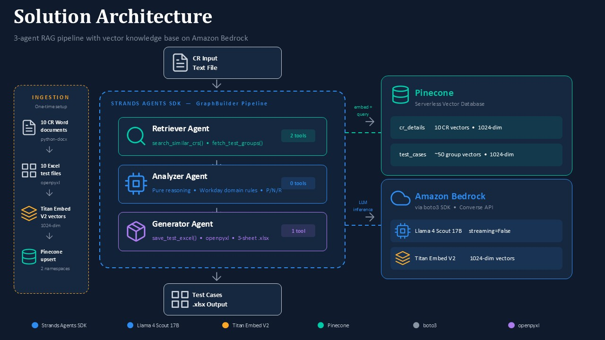

# Workday CR Test Case Generator

An agentic AI solution that automatically generates structured test cases for Workday Expenses Change Requests. The system uses a 3-agent RAG (Retrieval-Augmented Generation) pipeline to read a new Change Request, retrieve similar past CRs from a vector knowledge base, and produce a complete test case deliverable as a formatted Excel workbook.

## The Problem

Creating test cases for Workday Expenses Change Requests is a manual, time-consuming process with several recurring pain points:

- Each CR takes 4–8 hours to analyze and produce 11–16 test cases with proper grouping, typing, and traceability.
- Test coverage quality varies between analysts — negative and regression scenarios are frequently under-represented or omitted entirely.
- Roughly 80% of Expenses CRs follow similar patterns (validation rules, spending caps, eligibility checks, date windows), yet analysts start from scratch every time with no systematic way to reuse past work.
- Formatting the standard 3-sheet Excel deliverable (test cases, traceability matrix, summary) adds 1–2 hours of overhead per CR.

## The Solution

A 3-agent sequential pipeline that takes a Change Request as a plain text file and outputs a formatted Excel workbook containing grouped test cases (Positive, Negative, Regression), a traceability matrix, and a summary sheet — all matching the team's existing deliverable format.

The pipeline is grounded in a RAG knowledge base built from 10 real Change Requests and their verified test case files. This means the AI doesn't generate tests from generic QA knowledge — it learns the structure, terminology, coverage patterns, and grouping conventions from actual past work.

## Architecture


### Agents

**Retriever Agent** — Has two tools: `search_similar_crs()` embeds the incoming CR text via Titan Embed V2 and queries the `cr_details` namespace in Pinecone to find the 3 most similar past CRs. `fetch_test_groups()` then retrieves the grouped test cases for those CRs from the `test_cases` namespace. The agent formats the retrieved data and passes it to the Analyzer.

**Analyzer Agent** — A pure reasoning agent with no external tools. It receives the new CR's business requirement and solution design along with the retrieved test patterns, then plans the test case structure: how many groups, which solution design points map to which components, what test types are needed (Positive, Negative, Regression), and what scenarios should be covered. Its system prompt encodes Workday-specific domain rules — validation rule hard stops, condition rules, expense item configurations, and the convention that regression tests always form the final group.

**Generator Agent** — Has one tool: `save_test_excel()`. It takes the Analyzer's structured test plan, converts it to a JSON payload, and calls the tool to produce a formatted 3-sheet Excel workbook using openpyxl. The output matches the exact format of the team's existing test deliverables, with proper TC numbering (P-01, N-01, R-01), traceability mapping, and summary counts.

### Knowledge Base

The Pinecone serverless vector database stores two namespaces:

**cr_details** — One 1024-dimension vector per CR (10 total). Each vector's metadata includes the CR ID, title, category, priority, module, business requirement text, solution design text, and test case counts broken down by type (positive, negative, regression).

**test_cases** — One 1024-dimension vector per test group (~50 total across 10 CRs). Each vector's metadata stores the group number, component name, design reference, and the complete list of test cases for that group as JSON (TC number, type, scenario, steps, expected result).

Vectors are generated by Amazon Titan Text Embeddings V2 (1024 dimensions) and used for semantic similarity search.

### Technology Stack

- **Strands Agents SDK** — Multi-agent orchestration via `GraphBuilder` (sequential graph: Retriever → Analyzer → Generator)
- **Amazon Bedrock** — LLM inference (Llama 4 Scout 17B, non-streaming via Converse API) and embeddings (Titan Embed V2)
- **Pinecone** — Serverless vector database (free tier, 2 namespaces)
- **boto3** — AWS SDK for Bedrock API calls
- **python-docx** — Parsing CR Word documents during ingestion
- **openpyxl** — Parsing source Excel files and generating the output workbook
- **python-dotenv** — Environment variable management

## Project Structure

```
workday-cr-test-gen/
├── shared.py                   # Config, Bedrock/Pinecone clients, embed(), get_model()
├── ingest.py                   # Document parsers + Pinecone upsert (one-time setup)
├── pipeline.py                 # GraphBuilder pipeline, run(), CLI entry point
├── agents/
│   ├── __init__.py
│   ├── retriever.py            # Retriever agent (2 tools)
│   ├── analyzer.py             # Analyzer agent (0 tools)
│   └── generator.py            # Generator agent (1 tool)
├── tests/
│   ├── test_shared.py          # 12 tests — config, embed(), get_index()
│   ├── test_ingest_parsers.py  # 16 tests — Word/Excel parsers across all 10 CRs
│   ├── test_generator_tool.py  # 14 tests — Excel output structure and errors
│   ├── test_agents.py          # 15 tests — agent definitions, tools, prompts
│   └── test_pipeline.py        # 16 tests — graph wiring, example data, input parsing
├── data/
│   └── solutions/              # 10 CR Word docs + 10 Excel test files
├── requirements.txt
└── .env                        # AWS_DEFAULT_REGION, PINECONE_API_KEY, etc.
```

## Prerequisites

- Python 3.10+
- An AWS account with Bedrock access enabled for Llama 4 Scout and Titan Embed V2 in your chosen region
- A Pinecone account (free tier is sufficient)
- AWS CLI configured with credentials (`aws configure`)

## Setup

```bash
# Clone and enter the project
cd workday-cr-test-gen

# Create virtual environment
python -m venv .venv
source .venv/bin/activate       # Linux/Mac
# .venv\Scripts\activate        # Windows

# Install dependencies
pip install -r requirements.txt

# Configure environment variables
cp .env.example .env
# Edit .env with your values:
#   AWS_DEFAULT_REGION=us-east-1
#   PINECONE_API_KEY=your-key-here
#   PINECONE_INDEX_NAME=workday-cr-tests
```

## Usage

### 1. Ingest the Knowledge Base (One-Time)

Place the 10 CR Word documents and 10 Excel test files in `data/solutions/`, then run:

```bash
python ingest.py --data-dir data/solutions
```

This parses all documents, generates embeddings, and upserts vectors to Pinecone.

### 2. Generate Test Cases

**From a text file** (recommended):

```bash
python pipeline.py --input CR-EXP-2026-011-input.txt --cr-id CR-EXP-2026-011
```

The input file should contain the business requirement text, followed by a `SOLUTION DESIGN` separator line, followed by the numbered solution design points. See the example input file for the expected format.

**Using the built-in example:**

```bash
python pipeline.py --example
```

**Interactive mode:**

```bash
python pipeline.py
```

Paste your business requirement, type `SOLUTION DESIGN` on its own line, paste the solution design, then press Ctrl+D.

The generated Excel file is saved to `generated_tests/CR-EXP-2026-XXX_TestCases.xlsx`.

## Running Tests

All 73 tests run with Python's built-in `unittest` framework — no additional test dependencies needed:

```bash
python -m unittest discover -s tests -v
```

The tests mock all cloud dependencies (Bedrock, Pinecone, Strands SDK) so they run offline, instantly, and at zero cost.

## Cost Estimate

Each pipeline run (one complete test case set) costs approximately **$0.0032** (~0.3 cents):

| Service                     | Cost       |
|-----------------------------|------------|
| Llama 4 Scout LLM (4 turns)| ~$0.0030   |
| Titan Embed V2 (4 calls)   | ~$0.0004   |
| Pinecone (4 queries)        | ~$0.00     |
| **Total**                   | **$0.0032**|

That's roughly 312 test case sets per dollar. Pinecone's free tier covers the knowledge base storage and query volume.

## Llama 4 Scout Configuration

Llama 4 Scout on Bedrock requires two specific settings in the `BedrockModel` configuration:

- `streaming=False` — Llama 4 Scout does not support tool use in streaming mode. This switches the SDK from the `ConverseStream` API to the `Converse` API.
- `include_tool_result_status=False` — Llama models reject the `status` field in tool result messages, which Strands includes by default.

Both are configured in `shared.py` via the `get_model()` factory function.
